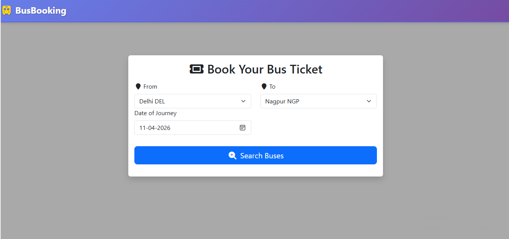
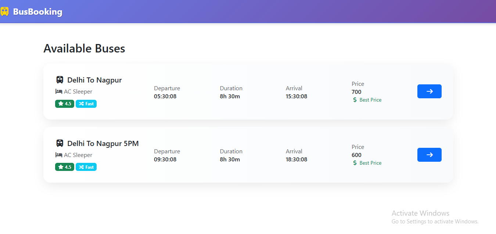
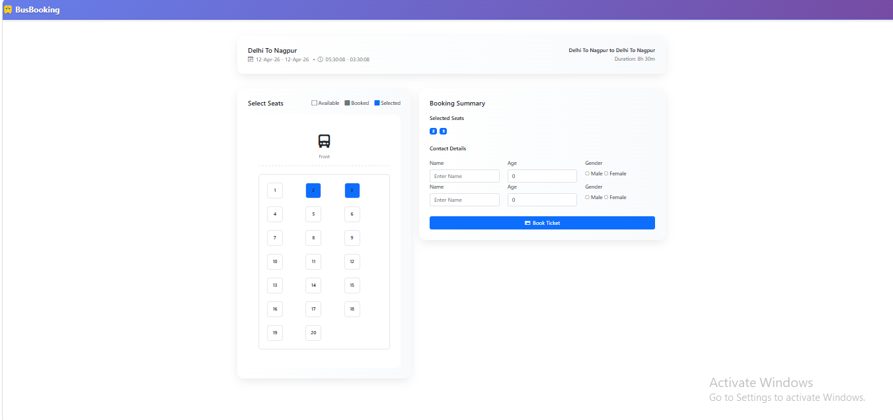
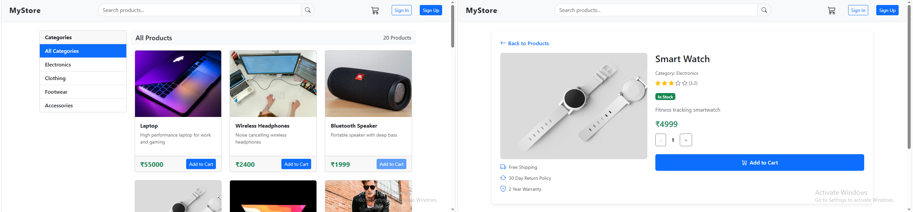
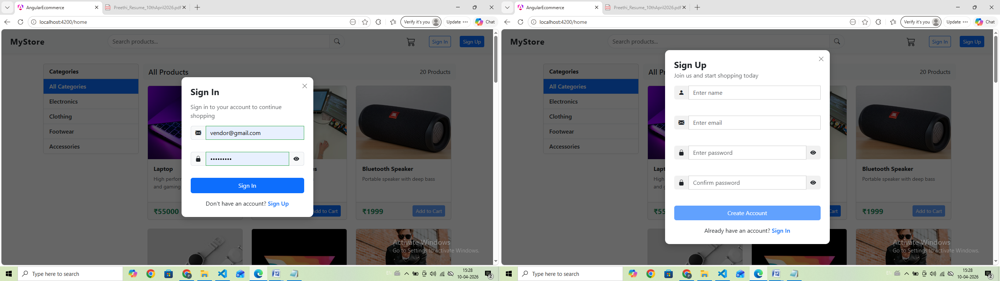
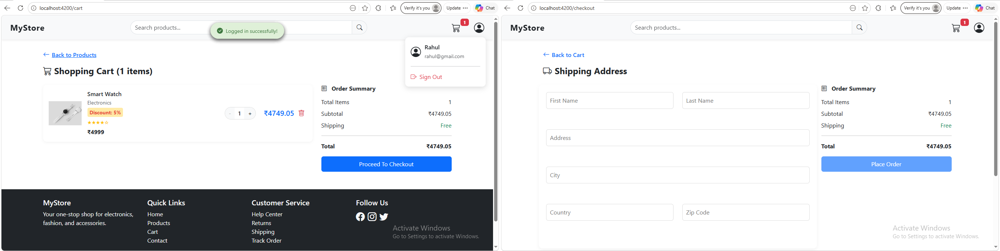
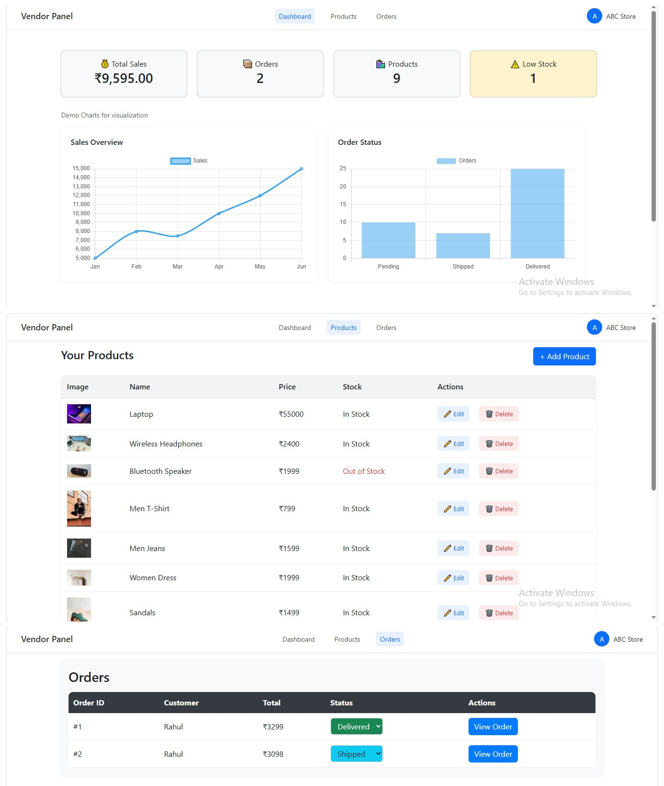
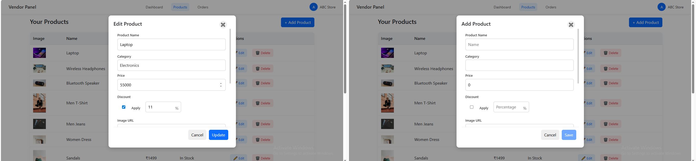

# Angular 18 Projects Master

## 📌 About
This repository contains Angular 18 projects demonstrating real-world frontend development concepts like API integration, dynamic UI, and modular architecture.

---

## 🚀 Tech Stack
- Angular 18
- TypeScript
- HTML, CSS, Bootstrap
- Angular Material
- REST APIs

---

## 📂 Projects

### 🚌 Bus Ticket Booking
- Integrated real-time API: https://api.freeprojectapi.com/api/BusBooking/
- Implemented bus listing, search, and booking features
- Used HTTPClient for API calls and dynamic data rendering
- Built responsive UI with user interactions

---

### 🛒 E-commerce Application
- Implemented using mock API integration
- Covered major Angular concepts:
  - Components & data binding  
  - Routing and navigation  
  - Reactive forms & validation  
  - Services & dependency injection  
  - HTTPClient for API handling  
  - Pipes and directives  
  - State handling and dynamic UI updates  
- Features include product listing, filtering, and user interactions

---

## ✨ Key Features
- API integration (real & mock)  
- Reusable components  
- Form validation  
- Dynamic data rendering  
- Responsive UI  

---
## 📸 Screenshots
<br>
### 🚌 Bus Ticket Booking
<br>

<br>

<br>

<br>
### 🛒 E-commerce
<br>

<br>

<br>

<br>

<br>

<br>
---

## ▶️ Run Locally
```bash
npm install
ng serve
